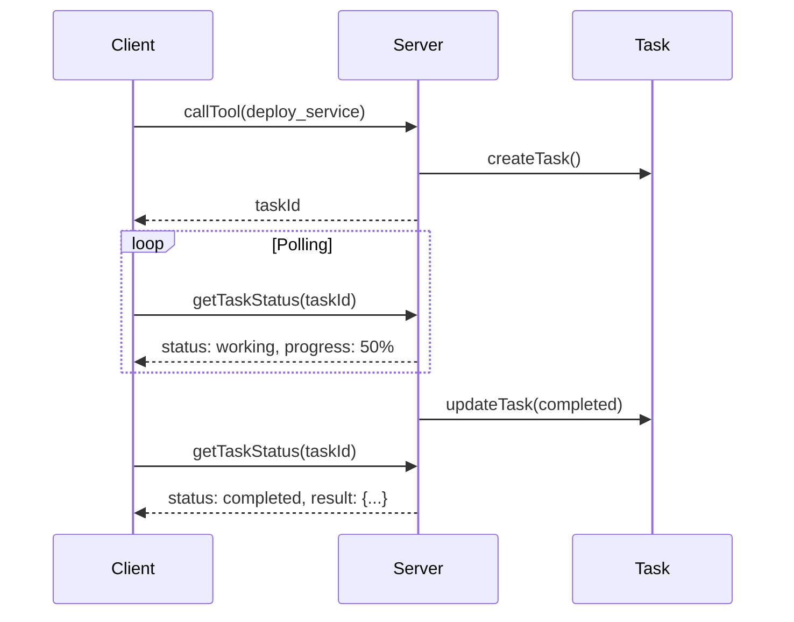
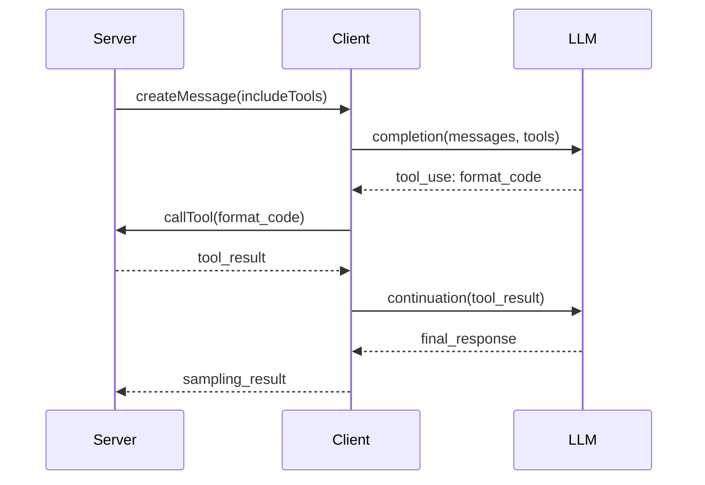

# Phase 8: Final Documentation and Testing

## Objective

Complete the MCP 2025-11-25 modernization by updating all documentation, ensuring comprehensive test coverage, creating upgrade guides, and producing a final modernization report.

## Documentation Updates

### Main Documentation Files

| File | Updates Needed |
|------|----------------|
| `README.md` | Add MCP 2025-11-25 features, update architecture |
| `ARCHITECTURE_DIAGRAMS.md` | Add Tasks, Elicitation, Sampling flows |
| `MCP_IMPLEMENTATION_ANALYSIS.md` | Update with new spec details |
| `CONTRIBUTING.md` | Update development guidelines |
| `docs/API_REFERENCE.md` | Document new APIs |
| `docs/GETTING_STARTED.md` | Update quick start |
| `docs/DEVELOPER_GUIDE.md` | Add new feature guides |

### New Documentation to Create

| File | Purpose |
|------|---------|
| `UPGRADE_GUIDE.md` | Migration from previous versions |
| `docs/features/TASKS.md` | Task system documentation |
| `docs/features/ELICITATION.md` | Elicitation guide |
| `docs/features/SAMPLING.md` | Sampling with tools guide |
| `docs/features/AUTHORIZATION.md` | Auth flow documentation |
| `MODERNIZATION_REPORT.md` | Final modernization summary |

## Files to Modify/Create

### Root Documentation
- `README.md` - Update feature list and architecture
- `UPGRADE_GUIDE.md` - Create migration guide (new)
- `CHANGELOG.md` - Document all changes (new or update)
- `ARCHITECTURE_DIAGRAMS.md` - Add new Mermaid diagrams

### API Documentation
- `docs/API_REFERENCE.md` - Add new endpoints and types
- `docs/GETTING_STARTED.md` - Update setup instructions
- `docs/DEVELOPER_GUIDE.md` - Add new patterns

### Feature Documentation
- `docs/features/TASKS.md` - Task implementation guide (new)
- `docs/features/ELICITATION.md` - Elicitation patterns (new)
- `docs/features/SAMPLING.md` - Sampling integration (new)
- `docs/features/AUTHORIZATION.md` - Auth flows (new)

### Package Documentation
- `packages/core/README.md` - Update with new exports
- `packages/servers/*/README.md` - Update tool documentation
- `packages/clients/*/README.md` - Update client features

## README.md Updates

### Feature Section Addition
```markdown
## MCP 2025-11-25 Features

This demo implements the full MCP 2025-11-25 specification:

### Tasks (Long-Running Operations)
- Async task tracking for deploy, scale, analyze operations
- Progress reporting and cancellation support
- Client-side task polling

### Elicitation
- Form-based elicitation for structured input
- URL elicitation for OAuth and secure flows
- Interactive user prompts from servers

### Sampling with Tools
- Server-initiated LLM completions
- Tool access during sampling
- Agentic workflow support

### Authorization
- OAuth with mandatory PKCE
- Client Credentials Flow (M2M)
- CLAUDE_CODE_OAUTH_TOKEN support

### JSON Schema 2020-12
- Updated schema dialect
- Enhanced validation patterns
- Zod v4 compatibility

### Resource Annotations
- Tool behavior hints (read-only, destructive)
- Icon metadata for UI display
- Audience targeting
```

## Architecture Diagram Updates

### Task Flow Diagram


### Sampling with Tools Flow


## Test Coverage Requirements

### Minimum Coverage Targets
- Overall: 80% (maintained from baseline)
- New features: 90% minimum
- Core package: 85%
- Servers: 80%
- Clients: 75%

### Test Files to Add/Update
- `packages/core/src/tasks/*.test.ts` - Task manager tests
- `packages/core/src/auth/*.test.ts` - Authorization tests
- `packages/core/src/sampling/*.test.ts` - Sampling tests
- `packages/servers/*/src/index.test.ts` - Server integration tests

## Modernization Report Structure

```markdown
# MCP TypeScript Demo - Modernization Report

## Executive Summary
- Modernization completed: [date]
- Target spec: MCP 2025-11-25
- SDK version: 1.24.3

## Changes Summary
| Phase | Description | Files Changed | Tests Added |
|-------|-------------|---------------|-------------|
| 0 | Baseline | 12 | 46 |
| 1 | SDK Upgrade | X | X |
| ... | ... | ... | ... |

## New Features
### Tasks
[Description and usage]

### Elicitation
[Description and usage]

...

## Breaking Changes
[List any breaking changes]

## Migration Guide
[Quick migration steps]

## Test Results
- Total tests: XXX
- Coverage: XX%

## Recommendations
[Future improvements]
```

## Requirements

1. Update main README.md with all new features
2. Create UPGRADE_GUIDE.md for migration
3. Update ARCHITECTURE_DIAGRAMS.md with new flows
4. Create feature documentation in docs/features/
5. Update API_REFERENCE.md with new endpoints
6. Update all package READMEs
7. Ensure test coverage meets targets
8. Generate MODERNIZATION_REPORT.md
9. Update .env.example with all new variables
10. Review and update CONTRIBUTING.md

## Acceptance Criteria

- [ ] README.md documents all MCP 2025-11-25 features
- [ ] UPGRADE_GUIDE.md created with migration steps
- [ ] Architecture diagrams include new flows
- [ ] Feature documentation complete for Tasks, Elicitation, Sampling, Auth
- [ ] API reference updated with all new endpoints
- [ ] Test coverage ≥ 80% overall
- [ ] New features have ≥ 90% coverage
- [ ] MODERNIZATION_REPORT.md generated
- [ ] All links in documentation work
- [ ] No TypeScript or build errors

## Commands to Run

```bash
# Generate test coverage report
pnpm test:coverage

# Build documentation (if using doc generator)
pnpm docs:build

# Run modernization report generation
modernize report . --output MODERNIZATION_REPORT.md

# Final verification
pnpm build && pnpm test
```

## References

- [MCP 2025-11-25 Specification](https://modelcontextprotocol.io/specification/2025-11-25)
- [MCP TypeScript SDK](https://github.com/modelcontextprotocol/typescript-sdk)
- [MCP Blog - First Anniversary](https://blog.modelcontextprotocol.io/posts/2025-11-25-first-mcp-anniversary/)
