# MCP TypeScript Demo Architecture Diagrams

This document provides visual representations of the Model Context Protocol (MCP) TypeScript demonstration project architecture, component interactions, and data flows.

## Table of Contents
1. [System Overview](#system-overview)
2. [Component Interaction](#component-interaction)
3. [Server Architecture](#server-architecture)
4. [Transport Layer](#transport-layer)
5. [Data Flow](#data-flow)
6. [Deployment Architecture](#deployment-architecture)
7. [Security Model](#security-model)

## System Overview

The complete MCP ecosystem showing all components and their relationships:


## Component Interaction

Detailed MCP protocol message flow between clients and servers:


## Server Architecture

Internal structure of a typical MCP server implementation:


## Transport Layer

Transport mechanisms and message flow:


## Data Flow

How different types of data flow through the MCP system:

### Core Server Features

```mermaid
flowchart TD
    %% Set larger font size
    classDef default font-size:18px,font-weight:bold;
    
    subgraph ToolFlow ["🔧 Tool Execution Flow"]
        ToolReq["📞 Client: tools/call"]
        ToolValidate{"✅ Validate Input"}
        ToolExec["⚙️ Execute Tool"]
        ToolProgress["📈 Progress Updates"]
        ToolResult["📋 Return Result"]
        ToolSuccess["✅ Success Response"]
        ToolError["❌ Error Response"]
        ToolErrorResult["⚠️ Error in Result"]
        
        ToolReq --> ToolValidate
        ToolValidate -->|Valid| ToolExec
        ToolValidate -->|Invalid| ToolError
        ToolExec --> ToolProgress
        ToolProgress --> ToolResult
        ToolResult -->|"isError: false"| ToolSuccess
        ToolResult -->|"isError: true"| ToolErrorResult
    end
```

```mermaid
flowchart TD
    %% Set larger font size
    classDef default font-size:18px,font-weight:bold;
    
    subgraph PromptFlow ["📝 Prompt Flow"]
        PromptList["📋 Client: prompts/list"]
        PromptGet["🔍 Client: prompts/get"]
        PromptArgs["📥 Provide Arguments"]
        PromptTemplate["🎯 Apply Template"]
        PromptContent["📤 Return Messages"]
        
        PromptList --> PromptGet
        PromptGet --> PromptArgs
        PromptArgs --> PromptTemplate
        PromptTemplate --> PromptContent
    end
```

```mermaid
flowchart TD
    %% Set larger font size
    classDef default font-size:18px,font-weight:bold;
    
    subgraph ResourceFlow ["📁 Resource Flow"]
        ResourceReq["📖 Client: resources/read"]
        ResourceFetch["🔍 Fetch Resource"]
        ResourceData["📄 Return Contents"]
        
        ResourceSub["🔔 Client: resources/subscribe"]
        ResourceWatch["👁️ Watch for Changes"]
        ResourceNotify["📢 resources/updated"]
        
        ResourceReq --> ResourceFetch
        ResourceFetch --> ResourceData
        
        ResourceSub --> ResourceWatch
        ResourceWatch -->|"Change Detected"| ResourceNotify
    end
```

### Client Features

```mermaid
flowchart TD
    %% Set larger font size
    classDef default font-size:18px,font-weight:bold;
    
    subgraph SamplingFlow ["🤖 Sampling Flow"]
        SampleStart["🎯 Server needs LLM"]
        SampleReq["🤖 Server: CreateMessage"]
        ClientForward["📡 Client forwards to LLM"]
        LLMProcess["🧠 LLM generates response"]
        SampleResp["📨 Return to Server"]
        SampleUse["💡 Server uses response"]
        
        SampleStart --> SampleReq
        SampleReq --> ClientForward
        ClientForward --> LLMProcess
        LLMProcess --> SampleResp
        SampleResp --> SampleUse
    end
```

```mermaid
flowchart TD
    %% Set larger font size
    classDef default font-size:18px,font-weight:bold;
    
    subgraph ElicitationFlow ["🤝 Elicitation Flow"]
        ElicitStart["🤔 Server needs input"]
        ElicitReq["❓ Server: Elicit Input"]
        UserPrompt["👤 Show to User"]
        UserInput["💬 User Response"]
        ElicitResp["📤 Client: Response"]
        ContinueExec["▶️ Continue Execution"]
        
        ElicitStart --> ElicitReq
        ElicitReq --> UserPrompt
        UserPrompt --> UserInput
        UserInput --> ElicitResp
        ElicitResp --> ContinueExec
    end
```

## Deployment Architecture

Server deployment and network topology:

```mermaid
flowchart TD
    %% Set larger font size and vertical layout
    classDef default font-size:18px,font-weight:bold;
    
    subgraph ClientLayer ["📱 Client Applications Layer"]
        direction LR
        WebApp["🌐 Web Client<br/>localhost:5173"]
        ClaudeChat["🤖 Claude Chat UI<br/>localhost:5174"]
        Desktop["🖥️ Desktop Client<br/>(Electron)"]
        CLI["⌨️ CLI Client<br/>(Terminal)"]
    end
    
    ClientLayer -.->|"🔽 Connections"| BridgeLayer
    
    subgraph BridgeLayer ["🔄 Bridge/Aggregator Layer"]
        CS["💬 chat-server<br/>localhost:4000<br/>(Acts as MCP Client)"]
        CS -.- CSEnd["Endpoints:<br/>/chat, /health"]
    end
    
    BridgeLayer -.->|"🔽 MCP Protocol"| ServerLayer
    
    subgraph ServerLayer ["🌐 MCP Server Layer"]
        direction LR
        
        subgraph DevSrv ["Dev Tools"]
            DT["🔧 dev-tools<br/>:3001"]
            DTEnd["📋 /mcp<br/>/sse<br/>/messages"]
        end
        
        subgraph AnSrv ["Analytics"]
            AN["📈 analytics<br/>:3002"]
            ANEnd["📋 /mcp<br/>/sse<br/>/messages"]
        end
        
        subgraph CloudSrv ["Cloud Ops"]
            CO["☁️ cloud-ops<br/>:3003"]
            COEnd["📋 /mcp"]
        end
        
        subgraph KnowSrv ["Knowledge"]
            KB["📁 knowledge<br/>:3004"]
            KBEnd["📋 /mcp"]
        end
    end
    
    %% Direct client connections
    WebApp ==>|"JSON-RPC/HTTP"| DT
    WebApp ==>|"JSON-RPC/HTTP"| AN
    CLI ==>|"JSON-RPC/HTTP"| CO
    Desktop ==>|"JSON-RPC/HTTP"| KB
    
    %% Claude Chat to chat-server
    ClaudeChat ==>|"HTTP REST API"| CS
    
    %% Chat Server as MCP Client
    CS ==>|"JSON-RPC/HTTP"| DT
    CS ==>|"JSON-RPC/HTTP"| AN
    CS ==>|"JSON-RPC/HTTP"| CO
    CS ==>|"JSON-RPC/HTTP"| KB
    
    %% Endpoint associations
    DT -.-> DTEnd
    AN -.-> ANEnd
    CO -.-> COEnd
    KB -.-> KBEnd
```

## Security Model

Security boundaries and access control:

```mermaid
flowchart TD
    %% Set larger font size
    classDef default font-size:18px,font-weight:bold;
    
    subgraph RequestProcessing ["🔐 Request Processing Pipeline"]
        Request["📨 Incoming Request"]
        
        subgraph TransportSec ["🌐 Transport Layer"]
            Origin["✓ Origin Header Validation"]
            Session["🔑 Session Authentication"]
            Local["📍 Localhost Binding Check"]
        end
        
        subgraph InputVal ["🛡️ Input Validation"]
            Zod["📋 Zod Schema Validation"]
            Path["🚫 Path Traversal Prevention"]
            Sanitize["🧹 Input Sanitization"]
        end
        
        subgraph AccessCtrl ["🔒 Access Control"]
            Roots["📂 Roots-based FS Access"]
            Consent["👤 User Consent Check"]
            Capability["🎯 Capability Verification"]
        end
        
        Execute["⚙️ Execute Operation"]
        Response["📤 Send Response"]
        
        Request --> Origin
        Origin --> Session
        Session --> Local
        Local --> Zod
        Zod --> Path
        Path --> Sanitize
        Sanitize --> Roots
        Roots --> Consent
        Consent --> Capability
        Capability --> Execute
        Execute --> Response
    end
    
    subgraph ErrorHandling ["❌ Error Paths"]
        direction LR
        TransportErr["🚫 Transport Error<br/>(401/403)"]
        ValidationErr["⚠️ Validation Error<br/>(400)"]
        AuthzErr["🔒 Authorization Error<br/>(403)"]
        InternalErr["💥 Internal Error<br/>(500)"]
    end
```

### Completion Flow


### Pagination Flow


### Cancellation Flow


## Message Types Overview

Quick reference for MCP message types:


## Error Handling

Comprehensive error handling across MCP features:

### Standard JSON-RPC Error Codes

```mermaid
flowchart LR
    %% Set larger font size
    classDef default font-size:18px,font-weight:bold;
    
    subgraph ErrorCodes ["📊 Standard Error Codes"]
        direction TB
        E32700["❌ -32700: Parse error<br/>Invalid JSON received"]
        E32600["❌ -32600: Invalid Request<br/>JSON not valid Request object"]
        E32601["❌ -32601: Method not found<br/>Method does not exist"]
        E32602["❌ -32602: Invalid params<br/>Invalid method parameters"]
        E32603["❌ -32603: Internal error<br/>Internal JSON-RPC error"]
        E32002["❌ -32002: Resource not found<br/>MCP-specific error"]
    end
```

### Feature-Specific Error Handling

#### Resource Errors

```mermaid
flowchart LR
    %% Set larger font size
    classDef default font-size:18px,font-weight:bold;
    
    subgraph Resources ["📁 Resource Error Scenarios"]
        direction TB
        R1["🔍 Resource URI doesn't exist<br/>↓<br/>Returns: -32002"]
        R2["🔒 Permission denied<br/>↓<br/>Returns: -32603"]
        R3["⚠️ Invalid resource URI<br/>↓<br/>Returns: -32602"]
        R4["💔 Binary encoding failure<br/>↓<br/>Returns: -32603"]
    end
```

#### Roots Errors

```mermaid
flowchart LR
    %% Set larger font size
    classDef default font-size:18px,font-weight:bold;
    
    subgraph Roots ["🌳 Roots Error Scenarios"]
        direction TB
        RT1["🚫 Client lacks capability<br/>↓<br/>Returns: -32601"]
        RT2["📴 Root becomes inaccessible<br/>↓<br/>Returns: -32603"]
        RT3["🛡️ Path traversal attempt<br/>↓<br/>Returns: -32602"]
        RT4["❌ Malformed root URI<br/>↓<br/>Returns: -32602"]
    end
```

#### Elicitation Response Handling

```mermaid
flowchart LR
    %% Set larger font size
    classDef default font-size:18px,font-weight:bold;
    
    subgraph Elicitation ["💬 Elicitation Response Types"]
        direction TB
        E1["✅ accept<br/>User approved with data"]
        E2["❌ decline<br/>User explicitly rejected"]
        E3["🚫 cancel<br/>User dismissed dialog"]
    end
    
    subgraph ElicitErrors ["⚠️ Elicitation Errors"]
        direction TB
        E4["📋 Schema validation fail<br/>↓<br/>Returns: -32602"]
        E5["⏱️ Rate limit exceeded<br/>↓<br/>Returns: -32603"]
    end
```

### Error Response Format

```mermaid
flowchart LR
    %% Set larger font size
    classDef default font-size:18px,font-weight:bold;
    
    subgraph Format ["📤 JSON-RPC Error Response"]
        Response["<pre>{
  'jsonrpc': '2.0',
  'id': <request_id>,
  'error': {
    'code': <error_code>,
    'message': 'Error description',
    'data': {
      'uri': '/path/to/resource',
      'reason': 'Additional context'
    }
  }
}</pre>"]
    end
    
    subgraph Example ["💡 Example"]
        ExampleResp["<pre>{
  'jsonrpc': '2.0',
  'id': 5,
  'error': {
    'code': -32002,
    'message': 'Resource not found',
    'data': {
      'uri': 'file:///missing.txt'
    }
  }
}</pre>"]
    end
```

### Security Best Practices

```mermaid
flowchart LR
    %% Set larger font size
    classDef default font-size:18px,font-weight:bold;
    
    subgraph Prevention ["🛡️ Error Prevention"]
        P1["Validate all URIs"]
        P2["Check permissions before access"]
        P3["Prevent path traversal attacks"]
        P4["Implement rate limiting"]
        P5["Protect sensitive information"]
    end
    
    subgraph Handling ["⚠️ Error Handling"]
        H1["Return appropriate error codes"]
        H2["Include helpful error context"]
        H3["Log security events"]
        H4["Fail gracefully"]
        H5["Don't leak implementation details"]
    end
```

## VSCode Extension Architecture

The VSCode extension acts as a full MCP client with visual interface:

```mermaid
graph TD
    subgraph "VSCode Extension"
        Activate[Extension Activation]
        
        subgraph "UI Components"
            ActivityBar[Activity Bar Icon]
            TreeViews[Tree Views]
            StatusBar[Status Bar Item]
            Commands[Command Palette]
            OutputChannel[Output Channel]
        end
        
        subgraph "Core Services"
            ServerManager[Server Manager]
            ConfigLoader[Configuration Loader]
            ConnectionPool[Connection Pool]
        end
        
        subgraph "Tree Providers"
            ServerTree[MCP Servers Tree]
            CapabilityTree[Capabilities Tree]
        end
        
        subgraph "MCP Client"
            HTTPTransport[HTTP Transport]
            SessionManager[Session Manager]
            RequestHandler[Request Handler]
        end
    end
    
    subgraph "MCP Servers"
        Server1[dev-tools-server]
        Server2[analytics-server]
        Server3[cloud-ops-server]
        Server4[knowledge-server]
    end
    
    Activate --> ConfigLoader
    ConfigLoader --> ServerManager
    
    ActivityBar --> TreeViews
    TreeViews --> ServerTree
    TreeViews --> CapabilityTree
    
    Commands --> ServerManager
    ServerTree --> ServerManager
    CapabilityTree --> ServerManager
    
    ServerManager --> ConnectionPool
    ConnectionPool --> HTTPTransport
    HTTPTransport --> SessionManager
    SessionManager --> RequestHandler
    
    RequestHandler --> Server1
    RequestHandler --> Server2
    RequestHandler --> Server3
    RequestHandler --> Server4
    
    StatusBar -.-> ServerManager
    OutputChannel -.-> ServerManager
```

### Extension Lifecycle

```mermaid
sequenceDiagram
    participant VSCode
    participant Extension
    participant ServerManager
    participant MCPServer
    
    VSCode->>Extension: Activate extension
    Extension->>Extension: Load configuration
    Extension->>ServerManager: Initialize
    
    Note over ServerManager: Discover servers
    ServerManager-->>Extension: Servers found
    
    Extension->>VSCode: Register views
    Extension->>VSCode: Register commands
    Extension->>VSCode: Show status bar
    
    Note over VSCode,MCPServer: User connects to server
    VSCode->>Extension: Execute connect command
    Extension->>ServerManager: Connect to server
    ServerManager->>MCPServer: HTTP POST /mcp (initialize)
    MCPServer-->>ServerManager: Session ID + capabilities
    ServerManager->>MCPServer: initialized notification
    
    ServerManager-->>Extension: Connection success
    Extension->>VSCode: Update tree views
    Extension->>VSCode: Update status bar
```

## Summary

These diagrams illustrate the key architectural concepts of the MCP TypeScript demo:

1. **Modular Architecture**: Each server is self-contained with specific capabilities
2. **Flexible Transport**: Support for both stdio and HTTP-based communication
3. **Bidirectional Communication**: Servers can make requests to clients via sampling and elicitation
4. **Security Layers**: Multiple levels of validation and access control
5. **Scalable Design**: Session-based HTTP allows multiple concurrent clients
6. **Clear Separation**: The chat-server demonstrates how to build MCP clients that aggregate multiple servers
7. **VSCode Integration**: Full-featured extension acts as native MCP client with visual UI
8. **Advanced Features**: Completion support, pagination, and cancellation handling
9. **Real-time Updates**: Progress notifications and resource subscriptions
10. **Extensible Design**: Easy to add new servers, clients, and capabilities

The architecture enables building powerful AI-integrated applications while maintaining security, modularity, and extensibility. The VSCode extension demonstrates how to create rich development experiences on top of the MCP protocol.