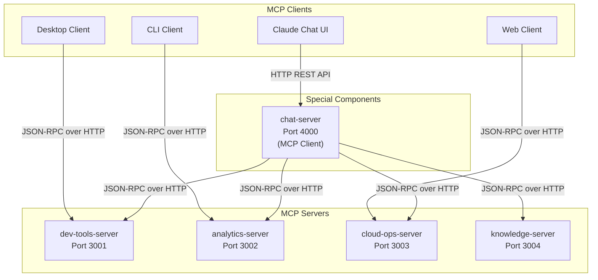

# MCP TypeScript Demo

A comprehensive demonstration of the Model Context Protocol (MCP) using TypeScript, showcasing all protocol features through practical, real-world applications. This project implements the MCP June 18 2025 specification with full protocol compliance.

## 🎯 Overview

This project demonstrates a complete MCP ecosystem following the client-host-server architecture:

### Core Components
- **4 Specialized MCP Servers**: Each focused on specific domain capabilities
  - Development Tools (port 3001)
  - Data Analytics (port 3002) 
  - Cloud Operations (port 3003)
  - Knowledge Base (port 3004)
- **1 MCP Client Server**: Chat Server (port 4000) - bridges multiple MCP servers
- **4 Client Applications**: Desktop GUI, CLI, Web, and Enhanced Claude Chat UI
- **3 Integrated Applications**: VSCode Extension, Data Science Notebook, DevOps Dashboard

### Protocol Implementation
Built on **JSON-RPC 2.0** with support for:
- Three message types: Requests, Responses, and Notifications
- Stateful sessions with capability negotiation
- Multiple transport options: stdio and Streamable HTTP

## 🏗️ Architecture

### Project Structure
```
mcp-typescript-demo/
├── packages/
│   ├── core/               # Shared utilities, types, and schemas
│   ├── servers/            # MCP server implementations
│   │   ├── dev-tools/      # Code formatting, file ops, project scanning
│   │   ├── analytics/      # Data analysis, statistics, visualizations  
│   │   ├── cloud-ops/      # Infrastructure management, monitoring
│   │   ├── knowledge/      # Documentation, search, knowledge base
│   │   └── chat-server/    # Special server that acts as MCP client
│   ├── clients/
│   │   ├── desktop/        # Electron-based GUI client
│   │   ├── cli/            # Terminal-based client
│   │   ├── web/            # Browser-based client
│   │   └── claude-chat/    # Enhanced chat UI with elicitation
│   └── apps/
│       ├── vscode-ext/     # VSCode extension integration
│       ├── notebook/       # Jupyter-style data science notebook
│       └── devops-dash/    # DevOps monitoring dashboard
```

### System Overview


📋 **For detailed architecture diagrams**: See [ARCHITECTURE_DIAGRAMS.md](./ARCHITECTURE_DIAGRAMS.md)

## 🚀 Quick Start

### Prerequisites
- Node.js 20+
- pnpm 8+

### Installation
```bash
# Clone the repository
git clone <repo-url>
cd mcp-typescript-demo

# Install dependencies
pnpm install

# Build all packages
pnpm build
```

### Running Servers

Servers support two transport modes:

#### stdio Mode (Default)
```bash
# Development Tools Server
cd packages/servers/dev-tools
pnpm start

# Analytics Server
cd packages/servers/analytics
pnpm start
```

#### HTTP Mode (Streamable HTTP Transport)
```bash
# Development Tools Server (HTTP on port 3001)
cd packages/servers/dev-tools
pnpm start -- --http

# Analytics Server (HTTP on port 3002)
cd packages/servers/analytics
pnpm start -- --http

# Cloud Operations Server (HTTP on port 3003)
cd packages/servers/cloud-ops
pnpm start -- --http

# Knowledge Base Server (HTTP on port 3004)
cd packages/servers/knowledge
pnpm start -- --http

# Chat Server (HTTP on port 4000)
cd packages/servers/chat-server
pnpm dev
```

### Running Clients

```bash
# Desktop Client (not yet implemented)
cd packages/clients/desktop
pnpm start

# CLI Client
cd packages/clients/cli
pnpm start

# Web Client
cd packages/clients/web
pnpm dev

# Enhanced Claude Chat UI
cd packages/clients/claude-chat
pnpm dev
```

## 📚 Features Demonstrated

### MCP Protocol Features
- ✅ **Transports**: 
  - stdio (direct process communication)
  - Streamable HTTP (with session management and SSE streaming)
- ✅ **Lifecycle**: Complete initialization → operation → shutdown flow
- ✅ **Capability Negotiation**: Dynamic feature discovery and negotiation
- ✅ **Bidirectional Communication**: Full request/response and notification patterns
- ✅ **Session Management**: Stateful connections with session IDs
- ✅ **Progress Tracking**: Real-time operation progress with tokens
- ✅ **Cancellation**: Graceful operation termination support

### Server Features (All Servers)
- ✅ **Resources**: 
  - Dynamic content discovery
  - URI-based identification
  - Subscription support with change notifications
- ✅ **Tools**: 
  - Function execution with Zod schema validation
  - Structured and unstructured responses
  - Error handling with `isError` flag
- ✅ **Prompts**: 
  - Templated workflows with argument support
  - User-controlled interactions
- ✅ **Advanced Features**:
  - Elicitation for interactive user input
  - Sampling for LLM content generation
  - Completion support for argument suggestions

### Client Features
- ✅ **Roots**: Secure file system access boundaries
- ✅ **Sampling**: Server-initiated LLM interactions
- ✅ **Elicitation**: Interactive information gathering from users
- ✅ **Multi-server Management**: Concurrent server connections

### Server-Specific Capabilities

#### dev-tools-server (Port 3001)
- **Tools**: `format-code`, `list-files`, `read-file`, `scan-project`
- **Resources**: `project-structure`, `recent-changes`
- **Advanced**: Interactive code review, documentation generation

#### analytics-server (Port 3002)
- **Tools**: `calculate-statistics`, `generate-sample-data`, `export-data`
- **Resources**: `csv-data/{filename}`, `analysis-results`
- **Features**: Progress tracking, interactive analysis preferences

#### cloud-ops-server (Port 3003)
- **Tools**: `check-service-health`, `deploy-service`, `scale-service`, `manage-alerts`
- **Resources**: `service-status`, `deployment-history`, `system-metrics`
- **Features**: Real-time monitoring, operational analytics

#### knowledge-server (Port 3004)
- **Tools**: `create-document`, `search-documents`, `list-categories`
- **Resources**: `documents/{id}`, `categories`, `search-index`
- **Features**: Full-text search with Fuse.js, change notifications

#### chat-server (Port 4000)
- **Unique Role**: Acts as MCP client, not traditional server
- **Features**: Multi-provider LLM support (Claude, OpenAI)
- **Purpose**: Bridges multiple MCP servers for chat applications

## 🛠️ Development

### Scripts
```bash
# Development mode (with watch)
pnpm dev

# Build all packages
pnpm build

# Run tests
pnpm test

# Run tests with UI
pnpm test:ui

# Run tests with coverage
pnpm test:coverage

# Lint code
pnpm lint

# Type checking
pnpm typecheck

# Format code
pnpm format

# Clean build artifacts
pnpm clean
```

### Implementation Patterns

#### Creating a New Server
```typescript
import { Server as McpServer } from '@modelcontextprotocol/sdk/server/mcp.js';
import { z } from 'zod';

const server = new McpServer({
  name: 'your-server',
  version: '1.0.0'
}, {
  capabilities: {
    tools: true,
    resources: true,
    prompts: true,
    elicitation: true,
    sampling: true
  }
});

// Register a tool
server.registerTool('tool_name', {
  title: 'Human-readable title',
  description: 'What this tool does',
  inputSchema: z.object({
    param: z.string().describe('Parameter description')
  })
}, async (params) => {
  // Implementation
  return {
    content: [{type: 'text', text: 'Result'}]
  };
});
```

### Error Handling

The project implements comprehensive error handling with standard JSON-RPC error codes:

- `-32700`: Parse error - Invalid JSON
- `-32600`: Invalid Request
- `-32601`: Method not found
- `-32602`: Invalid params
- `-32603`: Internal error
- `-32002`: Resource not found (MCP-specific)

## 📖 Documentation

### Project Documentation
- [Architecture Diagrams](./ARCHITECTURE_DIAGRAMS.md) - Visual system documentation
- [MCP Implementation Analysis](./MCP_IMPLEMENTATION_ANALYSIS.md) - Deep dive into the implementation

### Server Documentation
- [Development Tools Server](./packages/servers/dev-tools/README.md)
- [Analytics Server](./packages/servers/analytics/README.md)
- [Cloud Operations Server](./packages/servers/cloud-ops/README.md)
- [Knowledge Base Server](./packages/servers/knowledge/README.md)
- [Chat Server](./packages/servers/chat-server/README.md)

### External Resources
- [MCP Specification (June 18 2025)](https://modelcontextprotocol.io/specification/2025-06-18)
- [MCP GitHub Repository](https://github.com/modelcontextprotocol/specification)

## 🧪 Testing

Comprehensive test coverage using Vitest:

```bash
# Run all tests
pnpm test

# Run specific package tests
pnpm --filter @mcp-demo/dev-tools-server test

# Run with coverage
pnpm test:coverage

# Interactive test UI
pnpm test:ui
```

### Test Infrastructure
- Unit tests for all server tools and resources
- Integration tests for protocol compliance
- Test utilities package for shared testing helpers
- MCP Inspector for protocol validation

## 🔒 Security

This project implements MCP security best practices:

### Transport Security
- Proper Origin header validation for HTTP transports
- Session-based authentication with secure IDs
- localhost binding for development servers

### Input Validation
- All inputs validated with Zod schemas
- Path traversal prevention in file operations
- Proper error boundaries and sanitized messages

### Access Control
- Roots-based file system access restrictions
- User consent requirements for operations
- Capability-based feature negotiation

## 🤝 Contributing

1. Fork the repository
2. Create a feature branch (`git checkout -b feature/amazing-feature`)
3. Make your changes
4. Add tests for new functionality
5. Ensure all tests pass (`pnpm test`)
6. Lint your code (`pnpm lint`)
7. Submit a pull request

### Development Guidelines
- Follow existing code patterns and conventions
- Use TypeScript strict mode
- Add comprehensive tests for new features
- Update documentation as needed
- Use conventional commits for clear history

## 📝 License

MIT License - see LICENSE file for details

## 🙏 Acknowledgments

- Built with the official [Model Context Protocol TypeScript SDK](https://github.com/modelcontextprotocol/typescript-sdk) by Anthropic
- Implements the [MCP June 18 2025 specification](https://modelcontextprotocol.io/specification/2025-06-18)
- Uses modern TypeScript tooling: Vite, Vitest, Turbo, and more