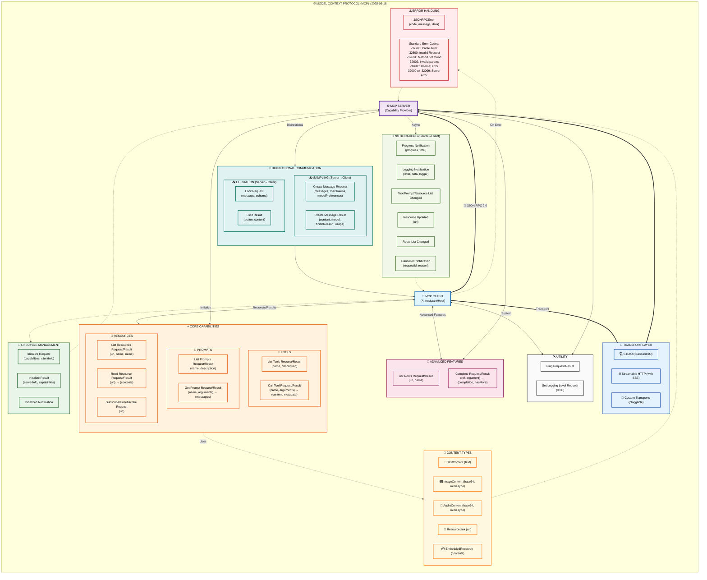

# MCP Client-Server Communication Flows

## Enhanced Model Context Protocol (MCP) v2025-06-18 Diagram



## Color-Coded ASCII Diagram (Alternative)

For environments that don't support Mermaid, here's a color-coded ASCII version:

```
┌─────────────────────────────────────────────────────────────────────────────────────────────────────────────────┐
│                    🌐 MODEL CONTEXT PROTOCOL (MCP) v2025-06-18 - Enhanced Diagram                                │
└─────────────────────────────────────────────────────────────────────────────────────────────────────────────────┘

🤖 CLIENT                                                                          ⚙️  SERVER
┌─────────────────────────┐                                                        ┌─────────────────────────┐
│   MCP CLIENT            │                     📡 JSON-RPC 2.0                    │   MCP SERVER            │
│ (AI Assistant/Host)     │◄──────────────────────────────────────────────────────►│ (Capability Provider)   │
└─────────────────────────┘                                                        └─────────────────────────┘
            │                                                                                     │
            │                         🚀 LIFECYCLE MANAGEMENT                                     │
            │                                                                                     │
            │ Initialize Request      ◄─────────────────────────────►      Initialize Result      │
            │ (capabilities, clientInfo)                                    (serverInfo, caps)    │
            │                                                                                     │
            │ Initialized Notification ──────────────────────────────►                            │
            │                                                                                     │
            │                         ⭐ CORE CAPABILITIES                                         │
            │                                                                                     │
            │ 🔧 List Tools Request    ◄─────────────────────────────►    🔧 List Tools Result    │
            │                                                              (name, description)    │
            │                                                                                     │
            │ 🔧 Call Tool Request     ◄─────────────────────────────►    🔧 Call Tool Result     │
            │ (name, arguments)                                            (content, metadata)    │
            │                                                                                     │
            │ 💬 List Prompts Request  ◄─────────────────────────────►  💬 List Prompts Result    │
            │                                                              (name, description)    │
            │                                                                                     │
            │ 💬 Get Prompt Request    ◄─────────────────────────────►   💬 Get Prompt Result     │
            │ (name, arguments)                                            (messages)             │
            │                                                                                     │
            │ 📁 List Resources Request ◄─────────────────────────────► 📁 List Resources Result  │
            │                                                              (uri, name, mime)      │
            │                                                                                     │
            │ 📁 Read Resource Request ◄─────────────────────────────►  📁 Read Resource Result   │
            │ (uri)                                                        (contents)             │
            │                                                                                     │
            │ 📁 Subscribe Request     ◄─────────────────────────────►     Empty Result           │
            │ (uri)                                                                               │
            │                                                                                     │
            │                         🎯 ADVANCED FEATURES                                        │
            │                                                                                     │
            │ List Roots Request      ◄─────────────────────────────►      List Roots Result      │
            │                                                              (uri, name)            │
            │                                                                                     │
            │ Complete Request        ◄─────────────────────────────►      Complete Result        │
            │ (ref, argument)                                              (completion, hasMore)  │
            │                                                                                     │
            │                       🔄 BIDIRECTIONAL COMMUNICATION                                │
            │                                                                                     │
            │ 📤 Create Message Request ────────────────────────────►   📤 Create Message Result   │
            │ (messages, maxTokens,                                       (content, model,        │
            │  modelPreferences)                                          finishReason, usage)    │
            │                                                                                     │
            │ 📥 Elicit Result         ◄─────────────────────────────    📥 Elicit Request        │
            │ (action, content)                                           (message, schema)       │
            │                                                                                     │
            │                         📢 NOTIFICATIONS                                            │
            │         (Server can send these any time, no response required)                      │
            │                                                                                     │
            │ Progress Notification   ◄──────────────────────────────                             │
            │ (progress, total)                                                                   │
            │                                                                                     │
            │ Logging Notification    ◄──────────────────────────────                             │
            │ (level, data, logger)                                                               │
            │                                                                                     │
            │ Tool List Changed       ◄──────────────────────────────                             │
            │ Notification                                                                        │
            │                                                                                     │
            │ Resource Updated        ◄──────────────────────────────                             │
            │ Notification (uri)                                                                  │
            │                                                                                     │
            │ Cancelled Notification  ◄────────────────────────────── or ──────────────────────►  │
            │ (requestId, reason)                                                                 │
            │                                                                                     │
            │                         🛠️ UTILITY                                                  │
            │                                                                                     │
            │ Ping Request            ◄─────────────────────────────►      Empty Result           │
            │                                                                                     │
            │ Set Logging Level       ────────────────────────────►      Empty Result             │
            │ Request (level)                                                                     │
            │                                                                                     │
            │                         📄 CONTENT TYPES                                            │
            │                                                                                     │
            │ • 📝 TextContent (text)                                                             │
            │ • 🖼️ ImageContent (base64 data, mimeType)                                          │
            │ • 🎵 AudioContent (base64 data, mimeType)                                           │
            │ • 🔗 ResourceLink (uri)                                                             │
            │ • 📦 EmbeddedResource (resource contents)                                           │
            │                                                                                     │
            │                         🚀 TRANSPORT LAYER                                          │
            │                                                                                     │
            │              • 💻 STDIO (Standard Input/Output)                                     │
            │              • 🌐 Streamable HTTP (with optional SSE streaming)                     │
            │              • 🔌 Custom Transports (pluggable)                                     │
            │                                                                                     │
            │                         ⚠️ ERROR HANDLING                                            │
            │                                                                                     │
            │ JSONRPCError           ◄─────────────────────────────► JSONRPCError                 │
            │ (code, message, data)                                  (code, message, data)        │
            │                                                                                     │
            │ Standard Error Codes:                                                               │
            │ • -32700: Parse error          • -32600: Invalid Request                            │
            │ • -32601: Method not found     • -32602: Invalid params                             │
            │ • -32603: Internal error       • -32000 to -32099: Server error                     │
            │                                                                                     │
            └──────────────────────────────────────────────────────────────────────────────────---┘
```

## Key Enhancements from Original Diagram

### **1. Complete Message Types**
- Added all request/result pairs from the specification
- Included sampling and elicitation (bidirectional communication)
- Added completion, ping, and logging utilities

### **2. Advanced Protocol Features**
- **Sampling**: Servers can request LLM completions from clients
- **Elicitation**: Servers can request user input through structured forms
- **Roots**: File system access control and permissions
- **Subscriptions**: Resource change notifications

### **3. Rich Content Support**
- Text, Image, Audio content types with base64 encoding
- Resource links and embedded resources
- MIME type support for different content formats

### **4. Comprehensive Notifications**
- Progress notifications for long-running operations
- Dynamic capability change notifications (tools, prompts, resources)
- Logging integration with standard severity levels
- Cancellation support for any operation

### **5. Protocol Metadata**
- `_meta` fields for extensibility
- Progress tokens for tracking long operations
- Annotations for UI hints and optimization
- Model preferences for sampling requests

### **6. Error Handling**
- Complete JSON-RPC 2.0 error codes
- Structured error responses with additional data
- Cancellation workflow for interrupted operations

## Protocol Flow Examples

### Typical Server Interaction Flow

```
1. Client → Server: Initialize Request
2. Server → Client: Initialize Result
3. Client → Server: Initialized Notification

4. Client → Server: List Tools Request
5. Server → Client: List Tools Result

6. Client → Server: Call Tool Request
7. Server → Client: Progress Notification (optional)
8. Server → Client: Call Tool Result

9. Client → Server: Read Resource Request
10. Server → Client: Read Resource Result
```

### Advanced Sampling Flow

```
1. Server → Client: Create Message Request
   (Server needs AI completion)
2. Client → Server: Create Message Result
   (Client provides LLM response)
```

### Elicitation Flow

```
1. Server → Client: Elicit Request
   (Server needs user input)
2. Client → Server: Elicit Result
   (Client provides user response)
```

## Implementation Notes

### For Server Developers
- Implement all core capabilities (tools, resources, prompts)
- Use proper JSON-RPC 2.0 error codes
- Send notifications for dynamic updates
- Support progress tokens for long operations

### For Client Developers
- Handle bidirectional communication (sampling, elicitation)
- Implement proper subscription management
- Support rich content types (text, images, audio)
- Manage connection lifecycle properly

### Transport Considerations
- **STDIO**: Best for command-line tools and simple integrations
- **HTTP/SSE**: Better for web applications and complex deployments
- **WebSocket**: Future transport for real-time applications

## Key Capabilities Summary

| Feature | Description | Direction |
|---------|-------------|-----------|
| **Tools** | Server-controlled functions | Client → Server |
| **Resources** | Data access points | Client → Server |
| **Prompts** | Workflow templates | Client → Server |
| **Sampling** | LLM completions | Server → Client |
| **Elicitation** | User input requests | Server → Client |
| **Notifications** | Async updates | Server → Client |
| **Roots** | File system access | Client → Server |
| **Completion** | Autocomplete support | Client → Server |

This enhanced diagram represents the complete scope of MCP v2025-06-18, showing it as a comprehensive protocol for AI-system integration with bidirectional communication, rich content support, and advanced features like sampling and elicitation.